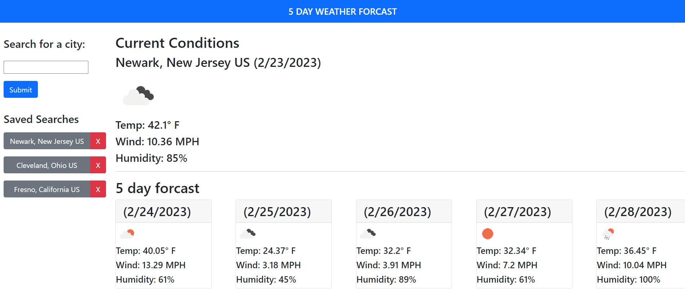

# Description
A webpage that lets users search for current and future weather conditions for any city they want.  
# Usage
When a user navigates to the webpage they are presented with a form to enter a city name and search for that cities current and future weather conditions. After typing in a city name and hitting submit since not all cities have unique names they are presented with the city name, the sate the city is in if its the usa and the country the city is in.  The user can select one of the cities and that city is then saved to localstorage and displayed in the saved searches section, the current weather and forcast are displayed on the webpage. The user can delete a saved search if they want. Three openweaterapp API's are used to get the weather from a city name.  One gets the latitude and longitude of cities that match the users search criteria, one that gets the current weather for that city and a third that gets the forcast for that city.

# Screenshot

# URL
[my webpage](https://michaeloc1.github.io/WeatherForecast/)
